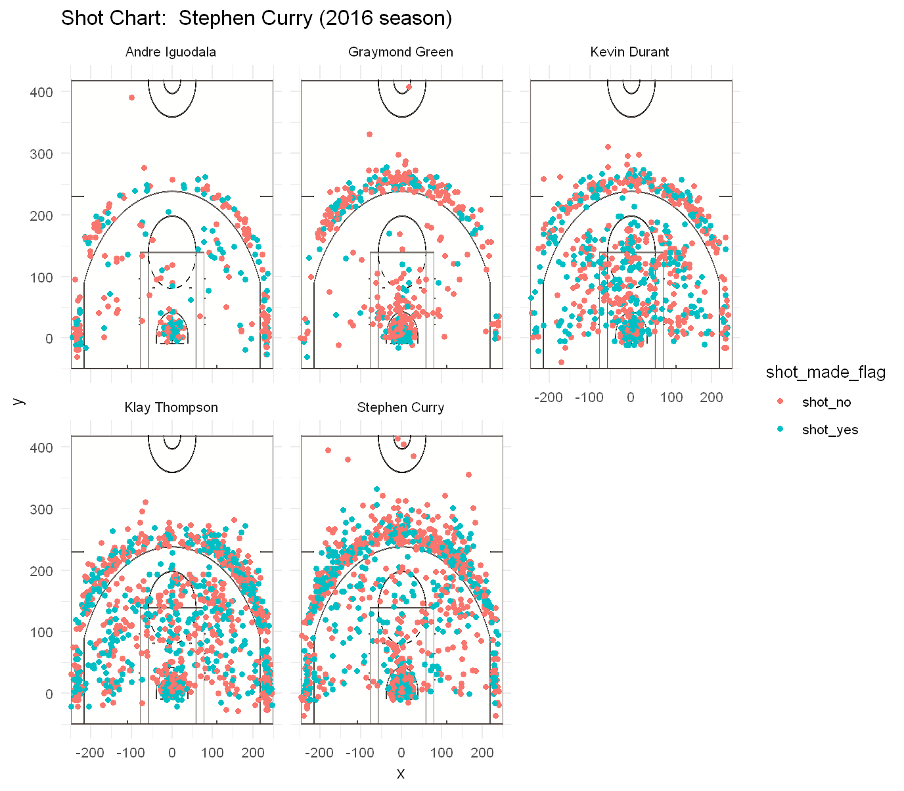

---
title :"Workout 1"
author :"Jiahao Cao"
output :github_document
---

<p align="center"> **Who is the most valuable player in GSW in season 2016?** </p>
---

```{r echo=FALSE}
library(dplyr) 
library(xtable)
library(ggplot2)
```

# 1.Introduction

The [Golden State Warriors](https://en.wikipedia.org/wiki/Golden_State_Warriors) is one of the best basketball team based in Oakland, California and there are many remarkable players in this team. We will analysis the performance of five players in GSW in 2016.

# 2.Data

We collected the shooting data form five famous players in GSW : Iguodala, Green, Durant, Thompson, and Curry. The data including both when and where every shoot occured in a game.

# 3.Analaysis

## 3.1 Overview

First let's take a look at the total points of each player and find who got the most points in 2016.
```{r echo=FALSE}
data <- read.csv('../data/shots-data.csv',stringsAsFactors = FALSE)
data <- mutate(data,distance=sqrt(x^2+y^2),score=(2*(shot_type=='2PT Field Goal' & shot_made_flag=='shot_yes')+3*(shot_type=='3PT Field Goal'& shot_made_flag=='shot_yes')))
ggplot(data=data,aes(x=name,y=score))+geom_bar(stat='identity',aes(fill=shot_type))+labs(title = "Total points by each player")
```

It seems Curry earned most points, which is about 1500 points, in 2016 and over half of points were earned by tree-points shooting. Klay Thompson also did a greak job. While on the contrary, Andre Iguodala earned only less than 500 points, more than half of which were earned by two-points shooting.

Here is the shot charts for each player:

```{r out.width='80%' , echo=FALSE , flg.align='center'}

```

```{r echo=FALSE}
data %>% ggplot()+geom_boxplot(aes(x=name,y=distance))+labs(title = 'Boxplot of the distance(ft) of shooting for each player')
```

As we can see, Graymond Green really tends to shoot near the basket while Stephen Curry is really enjoy to throw from a long distance! Maybe that's why many people like Curry's style.

## 3.2 Accuracy

Then consider the accuracy of each player:

```{r echo=FALSE}
data <- read.csv('../data/shots-data.csv')
data %>% filter(shot_type=='2PT Field Goal') %>% group_by(name)%>% summarise(total=sum(shot_type=='2PT Field Goal'),made=sum(shot_made_flag=='shot_yes'),perc_made=made/total) %>% arrange(desc(perc_made)) %>% knitr::kable(digits = 2,caption="2PT Effective Shooting percentages by Player")

data %>% filter(shot_type=='3PT Field Goal') %>% group_by(name)%>% summarise(total=sum(shot_type=='3PT Field Goal'),made=sum(shot_made_flag=='shot_yes'),perc_made=made/total) %>% arrange(desc(perc_made)) %>% knitr::kable(digits = 2,caption="3PT Effective Shooting percentages by Player")

data %>% group_by(name)%>% summarise(total=sum(shot_type=='3PT Field Goal' | shot_type=='2PT Field Goal' ),made=sum(shot_made_flag=='shot_yes'),perc_made=made/total) %>% arrange(desc(perc_made)) %>% knitr::kable(format.args=list(width=0.5),digits = 2,caption='Effective Shooting percentages by Player')
```

From the accuracy table above we can find the most "stable" player in the team. 

- Kevin Durant has the highest accuracy,which is 54%. 
- In the 2PT Shooting, Andre Iguodala shows great stability although he is the "worst" player according to his total score.
- In the 3PT shooting, Klay Thompson has the highest accuracy.

It is interesting to find Curry in total has only 47% accuracy but he earned the most points in his team, which means he tried to shoot frequently is the game and he is a pretty aggresive player.

## 4. Performance in each period

To get a better understanding, now we show some statistics of each player in different periods.

```{r echo=FALSE}
data <- read.csv('../data/shots-data.csv',stringsAsFactors = FALSE)
data <- mutate(data,distance=sqrt(x^2+y^2),score=(2*(shot_type=='2PT Field Goal' & shot_made_flag=='shot_yes')+3*(shot_type=='3PT Field Goal'& shot_made_flag=='shot_yes')))
ggplot(data=data,aes(x=period,y=score))+geom_bar(stat='identity',aes(fill=name))+labs(title = "Total points in each period")
```

Seems first and the third period are the gold period for GSW.


```{r echo=FALSE}
data <- read.csv('../data/shots-data.csv')


data_1=data %>% group_by(name)%>% summarise(total=sum((shot_type=='3PT Field Goal' | shot_type=='2PT Field Goal' )&period==1),made=sum(shot_made_flag=='shot_yes'&period==1),perc_made=made/total) %>% arrange(desc(perc_made)) 
data_1 <- mutate(data_1,period=1)

data_2=data %>% group_by(name)%>% summarise(total=sum((shot_type=='3PT Field Goal' | shot_type=='2PT Field Goal' )&period==2),made=sum(shot_made_flag=='shot_yes'&period==2),perc_made=made/total) %>% arrange(desc(perc_made))
data_2 <- mutate(data_2,period=2)

data_3=data %>% group_by(name)%>% summarise(total=sum((shot_type=='3PT Field Goal' | shot_type=='2PT Field Goal' )&period==3),made=sum(shot_made_flag=='shot_yes'&period==3),perc_made=made/total) %>% arrange(desc(perc_made))
data_3 <- mutate(data_3,period=3)


data_4=data %>% group_by(name)%>% summarise(total=sum((shot_type=='3PT Field Goal' | shot_type=='2PT Field Goal' )&period==4),made=sum(shot_made_flag=='shot_yes'&period==4),perc_made=made/total) %>% arrange(desc(perc_made))
data_4 <- mutate(data_4,period=4)


acc <- data.frame(name=data_1$name,perc_period_1=data_1$perc_made,perc_period_2=data_2$perc_made,perc_period_3=data_3$perc_made,perc_period_4=data_4$perc_made)
knitr::kable(acc,format.args=list(width=0.5),digits = 2,caption='Effective Shooting percentages by Player in each period')

```

It shows that most players tend to have lower accuracy as time goes by.

Kevin Durant and Andre Iguodala seem to maintain pretty high accuracy throughout the game.

# Conclusion

It hard to say who is the best--sounds boring?

Actually, the best player in your mind is decided by which characteristic you admire most. 

For me, i think Curry is outstanding. Maybe because he loves Long distance shooting?


---

